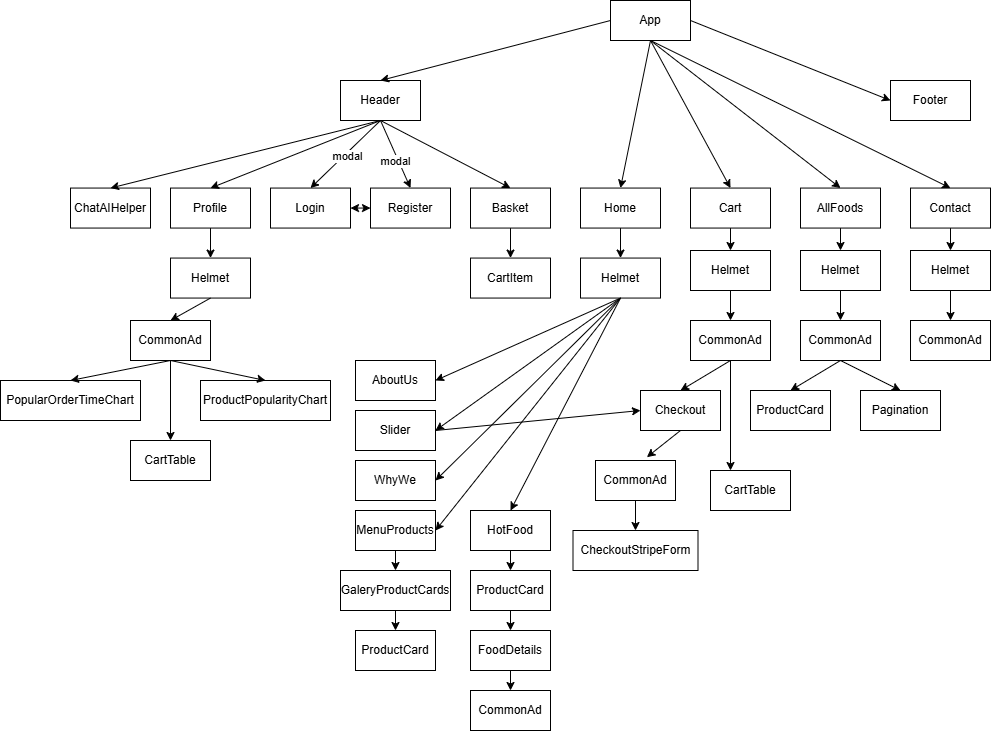

# Client part Food Ordering App

## List of Contents

- [Description](#description)
- [Technologies](#technologies)
- [Dependencies](#dependencies)
- [Project Structure](#project-structure)
- [Usage](#usage)
- [Author Info](#author-info)

## Description

This is the client-side code for the Fast Food Delivery App project. It is a React-based application that allows users to order food from a fast food restaurant and have it delivered to their location.

## Technologies

- `React.js`
- `Redux ToolKit`
- `React-Bootstrap`, `Bootstrap`
- `HTML/CSS/JS stack`

## Dependencies

#### The following dependencies are required to run this app:

- `"@reduxjs/toolkit": "^1.9.3"`
- `"bootstrap": "^5.2.3"`
- `"bootstrap-icons": "^1.10.3"`
- `"react": "^18.2.0"`
- `"react-bootstrap": "^2.7.2"`
- `"react-dom": "^18.2.0"`
- `"react-redux": "^8.0.5"`
- `"react-router-dom": "^6.8.1"`

## Project Structure

The web application has a wide range of client components that provide a variety of functionality for the user. Components are divided by functionality and are responsible for different aspects of the application, such as navigation, product display, user registration and authorization, as well as storage and processing of shopping cart and feedback data. Many different technologies and practices are used, such as Redux to manage application state, custom hooks to simplify component logic, and data validation in forms.

Components that display pages and main content such as "MenuProducts", "Slider", "WhyWe", "ProductCard", "AllFoods", "Cart", "Checkout", "Contact", "FoodDetails", "Profile" , "Home", "Login", and "Register", implement various functions and interact with the Redux store to save and update data. Each of these components has its own unique functionality and set of actions that the user can perform.

However, the components "Basket", "CartItem", "CartTable", "cartsLikedSlice", and "basketUISlice" are responsible for working with the shopping cart and list of likes. They provide the ability to add, remove, and update cart items, as well as display related messages and statuses.

Finally, custom hooks such as "useGetAllProducts", "useReview", "useValidationAuthForms", and "useValidFormsBtn" help to simplify and optimize the component logic, providing the required functionality and user interaction.

### Diagram of the functional components



## Usage

#### To run this app, you will need to have Node.js and npm installed on your computer. After cloning the repository, navigate to the root directory and run the following command to install the dependencies:

```javascript
// first install all necessary dependencies

npm i

// next run

npm start

```

### Scripts

---

##### The following scripts are available to run:

- `npm start`: Starts the development server.
- `npm test`: Runs tests for the app.
- `npm run build`: Builds the production-ready version of the app.
- `npm run deploy`: Deploys the app to GitHub pages.
- `npm run lint`: Runs ESLint to check the code for errors and warnings.
- `npm run lint:fix`: Runs ESLint and fixes any errors or warnings it finds.

### Features:

---

✔️ Add to cart functionality <br>
✔️ Product Filtering functionality <br>
✔️ Product page <br>
✔️ Cart and checkout page <br>
✔️ Contact page <br>
✔️ Login and Register page + Data Validation<br>
✔️ Crart components to analitics
✔️ Stripe components to payment

### Markers

---

✔️ - Done <br>
❌ - Unfinished

## Author Info

- [Linkedin](https://www.linkedin.com/in/dmytro-kohol-333a7a2aa/)

- [GitHub](https://github.com/dima666Sik)

[Back To The Top](#description)
