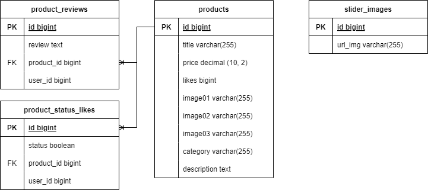

# Server part Food Ordering App

## List of Contents

- [Description](#description)
- [Technologies](#technologies)
- [Project Structure](#project-structure)
- [Author Info](#author-info)

---

## Description

### Preview, I hope you enjoy it 😊

Welcome to server part of the Food Ordering App that consists of APIs for interacting with the client side application.
For the backend, we used the WebFlux, Liquibase, Spring Security, R2DBC PostgreSql,
Stripe API, RabbitMQ, OpenAI API, Thymeleaf, Eureka, Gmail SMTP Server, Docker.
The application uses the REST architectural approach, which involves using HTTP methods to interact with resources on
the server.
All technologies you can see in the part of this README.md under the heading [Technologies](#technologies).

---

## Technologies

- `Java Core`
- `WebFlux`
- `Liquibase`
- `Spring Security`
- `R2DBC PostgreSQL`
- `Stripe API`
- `RabbitMQ`
- `OpenAI API`
- `Thymeleaf`
- `Eureka`
- `JavaMail library(Gmail SMTP Server)`
- `Docker`
- `Maven`
- `lombok`

---

## Project Structure

- The microservices mainly consist of three layers (controller, service, repository).
- `Gateway-Auth-Service`: Manages authentication, authorization, and request routing between services.
- `Product-Service`: Handles product management, including retrieving product details and serving static files.
- `Email-Sender-Service`: Manages email notifications and communication with users.
- `Order-Service`: Processes customer orders, including order creation and tracking.
- `Stripe-Integration-Service`: Facilitates seamless payment processing through Stripe API.
- `Chat-Helper-AI-Service`: Integrates with an AI assistant to provide interactive customer support and enhanced user
  experience.

### Usecase Diagram

### The architecture of the backend of the web application

- The architecture of the backend of the web application: 
  
    - About the microservices you can check on [Project Structure](#project-structure).
    - About layers:
        - The web layer is the top layer of the architecture and is responsible for interacting with the user and
          processing
          incoming requests. The web layer processes HTTP requests, validates and processes input data, executes
          business
          logic, and returns the correct response to the user.
        - The service layer is responsible for implementing the business logic of the application. At this level,
          services
          can interact with the repository level to obtain the necessary data and ensure the execution of business
          rules.
        - The repository level is the lowest in the architecture and is responsible for storing and accessing
          application
          data.

### Web application database diagram

The application uses R2DBC PostgreSQL as the databases,
leveraging its reliability and scalability for handling complex data operations.
The databases include well-structured schemas:

- `Users Schema`: Stores user data, including credentials, roles, and authentication details.
- `Products Schema`: Manages product information, such as names, descriptions, prices, and images, etc.
- `Orders Schema`: Order details, statuses, and associated user and product data, etc.

#### Web application database (users_info_db):

#### Web application database (products_info_db):

#### Web application database (orders_info_db):

---

## Author Info

- [Linkedin](https://www.linkedin.com/in/dmytro-kohol-333a7a2aa/)

- [GitHub](https://github.com/dima666Sik)

[Back To The Top](#description)
